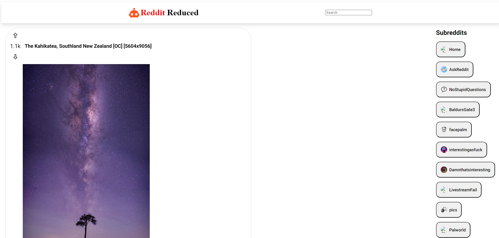

# Reddit Reduced

This project was all about incorporating Redux into a SPA to make it manage state and display the necessary information from the API calls.

## Planning

Before even starting I had to make sure I knew what to build. I did some research to get some inspiration and decided on a minimalistic, yet clean-looking design.

## Steps

1. First I made sure to set up the app with all the necessary packages. I decided to use Vite to quickly boot up a React app.

2. Then I had to design the header, which will house the search input.

3. I then made sure to create a Redux store, and the necessary slices to configure the store properly.

4. Once the store was set up, I then started writing the logic for my async thunks which will make the API calls to the website.

5. After I made sure my calls were working, and I had all the necessary information, I then started building out the UI.

6. Once the vision for the UI was realized, I began displaying the info I wanted from the JSON.

7. Finally, I made some key styling changes to make sure everything looked pretty. I also made sure to make the app responsive to all screen sizes.

### Here's what the app looks like when it loads up.

If you would like to visit the website yourself, I hosted it using Netlify.

Here's the URL - https://reddit-reduced.netlify.app/

